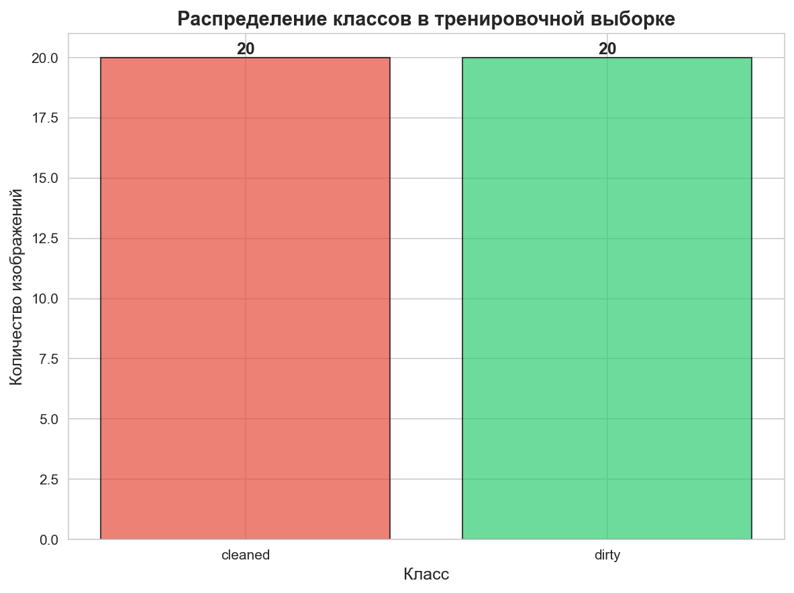
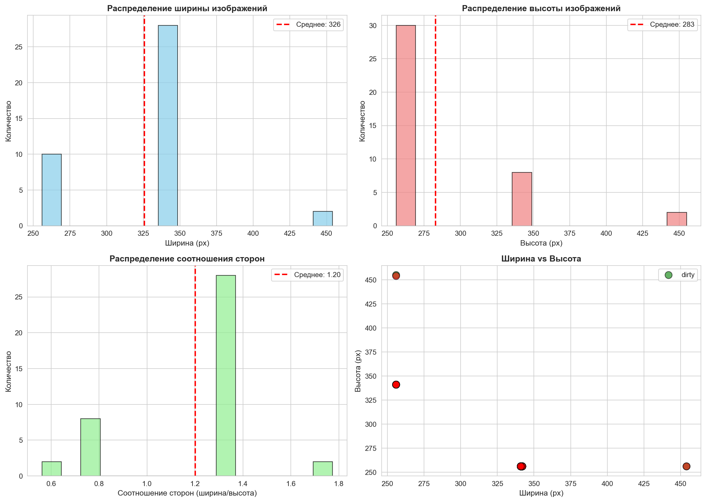
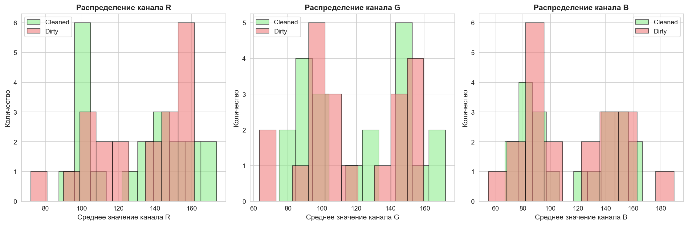
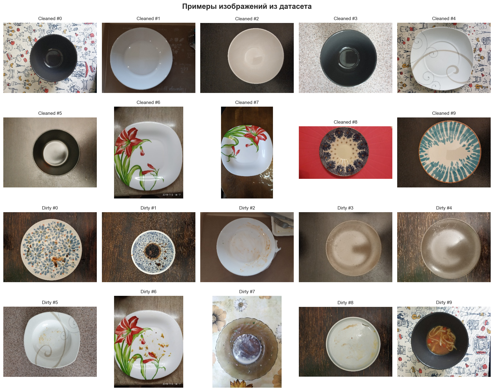
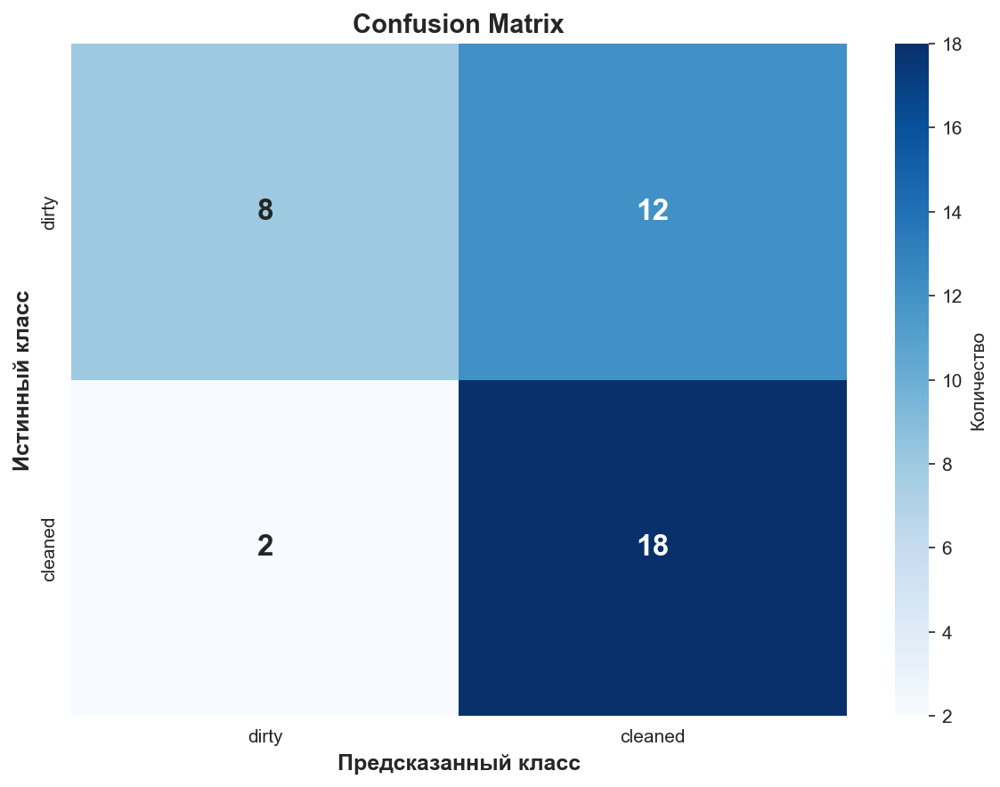
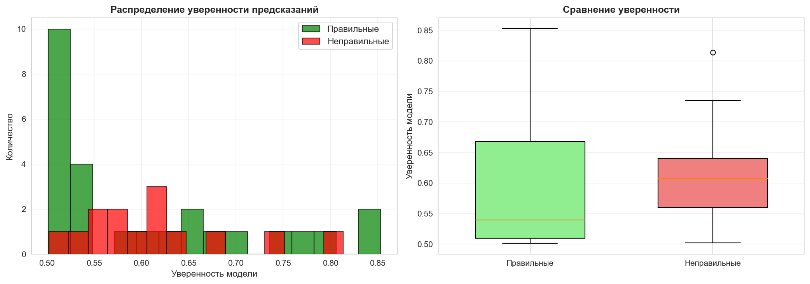
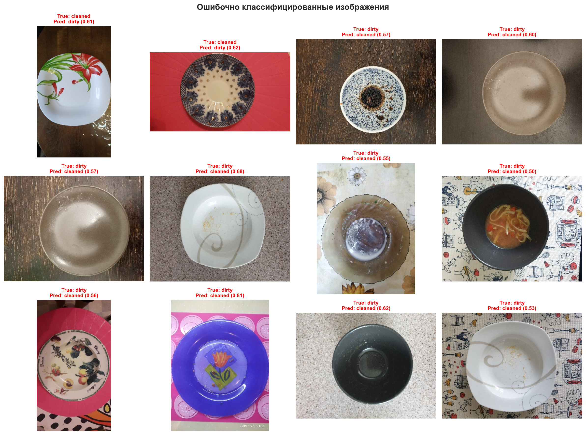

# Отчет по проекту: Классификация изображений тарелок (Cleaned vs Dirty V2)

**Дата:** 23 апреля 2025  
**Автор:** Хоменко Дмитрий  
**Задача:** Классификация изображений тарелок (Cleaned vs Dirty V2)

---

## 1. Введение и постановка задачи

### 1.1 Описание задачи

Задача заключается в бинарной классификации изображений тарелок на два класса:
- **Cleaned (чистые)** - тарелки после мытья
- **Dirty (грязные)** - тарелки с остатками еды

Это типичная задача компьютерного зрения с применением в автоматизации контроля качества мытья посуды в ресторанах и на производстве.

### 1.2 Цели проекта

1. Разработать модель машинного обучения для классификации изображений тарелок
2. Достичь максимальной точности (accuracy) на валидационной выборке
3. Провести полный анализ данных и результатов
4. Создать воспроизводимое решение с документацией

### 1.3 Метрики оценки

Основная метрика: **Accuracy** (доля правильных предсказаний)

Дополнительные метрики:
- Precision (точность)
- Recall (полнота)
- F1-score (гармоническое среднее precision и recall)

---

## 2. Обзор данных (EDA)

### 2.1 Структура датасета

- **Тренировочная выборка:** 40 изображений (20 cleaned + 20 dirty)
- **Тестовая выборка:** 744 изображения
- **Формат:** JPEG изображения в ZIP архиве
- **Баланс классов:** Идеально сбалансирован (50%/50%)



**Вывод:** Датасет очень маленький (40 изображений), что создает высокий риск переобучения. Классы сбалансированы, поэтому не требуется дополнительная балансировка.

### 2.2 Анализ размеров изображений



**Статистика размеров:**
- Ширина: min=256px, max=454px, mean=325.7px, std=47.0px
- Высота: min=256px, max=455px, mean=282.9px, std=51.9px
- Соотношение сторон: min=0.56, max=1.77, mean=1.20, std=0.30

**Выводы:**
- Изображения имеют разные размеры и пропорции
- Большинство изображений близки к квадратной форме (aspect ratio ≈ 1.2)
- Необходима нормализация размеров для подачи в нейронную сеть

### 2.3 Цветовые характеристики



**Выводы:**
- Грязные тарелки имеют более темные тона (меньшие значения RGB)
- Чистые тарелки более светлые и яркие
- Цветовые характеристики могут быть полезным признаком для классификации

### 2.4 Примеры изображений



**Наблюдения:**
- Чистые тарелки: белые, равномерный цвет, видны блики от света
- Грязные тарелки: остатки еды, пятна, неравномерный цвет
- Разнообразие ракурсов и освещения

---

## 3. Предобработка данных

### 3.1 Нормализация размеров

**SquarePad трансформация:**
- Приведение изображений к квадратной форме
- Заполнение отступов средним цветом изображения
- Сохранение пропорций объектов без искажений

### 3.2 Аугментация данных

Для борьбы с переобучением на малом датасете применяется агрессивная аугментация:

**Геометрические трансформации:**
- `RandomResizedCrop(scale=(0.72, 1.0), ratio=(0.9, 1.1))` - случайный crop с масштабированием
- `RandomHorizontalFlip()` - горизонтальное отражение
- `RandomVerticalFlip()` - вертикальное отражение  
- `RandomRotation(degrees=22)` - повороты до 22 градусов

**Цветовые трансформации:**
- `ColorJitter(brightness=0.12, contrast=0.12, saturation=0.12, hue=0.04)` - изменение яркости, контраста, насыщенности и оттенка

**Нормализация:**
- Resize до 160x160 пикселей
- Нормализация с ImageNet mean и std: `mean=(0.485, 0.456, 0.406)`, `std=(0.229, 0.224, 0.225)`

Аугментация важна для малого датасета, так как искусственно увеличивает разнообразие обучающих примеров и снижает переобучение.

---

## 4. Архитектура модели

### 4.1 Выбор архитектуры

**Модель:** MobileNetV3-Small

**Обоснование выбора:**
1. **Компактность:** Всего ~2,5 млн параметров - подходит для малых датасетов
2. **Эффективность:** Оптимизирована для мобильных устройств, быстрая инференс
3. **Предобученные веса:** Доступны веса ImageNet для transfer learning
4. **Доказанная эффективность:** Хорошо работает на задачах классификации изображений

### 4.2 Transfer Learning

**Стратегия:**
- Загружаем предобученные веса ImageNet
- Замораживаем все слои backbone
- Размораживаем только последний блок `features[-1]` и classifier
- Заменяем последний слой на бинарную классификацию (2 класса)

**Обоснование:** Transfer learning позволяет использовать признаки, выученные на большом датасете ImageNet (1.2M изображений), и дообучить только верхние слои на нашем малом датасете (40 изображений).

### 4.3 Схема модели

```
Input (160x160x3)
    ↓
MobileNetV3-Small Backbone (frozen)
    ↓
features[-1] (trainable)
    ↓
Classifier (trainable)
    ↓
Output (2 classes: dirty, cleaned)
```

---

## 5. Обучение модели

### 5.1 Гиперпараметры

| Параметр | Значение | Обоснование |
|----------|----------|-------------|
| Epochs | 10 | Достаточно для сходимости с early stopping |
| Batch size | 16 | Баланс между стабильностью и скоростью |
| Image size | 160x160 | Компромисс между качеством и скоростью |
| Learning rate (head) | 3e-4 | Стандартное значение для classifier |
| Learning rate (backbone) | 5e-5 | Меньше для тонкой настройки предобученных весов |
| Weight decay | 1e-4 | L2 регуляризация для борьбы с переобучением |
| Label smoothing | 0.05 | Регуляризация для уменьшения переобучения |
| Patience | 3 | Early stopping после 3 эпох без улучшения |

### 5.2 Оптимизатор и функция потерь

**Оптимизатор:** AdamW с раздельными learning rates
- Backbone: lr=5e-5 (медленное дообучение)
- Classifier: lr=3e-4 (быстрое обучение)

**Функция потерь:** CrossEntropyLoss с label smoothing=0.05

### 5.3 Кросс-валидация

**Метод:** StratifiedKFold с 3 фолдами
- Сохраняет баланс классов в каждом фолде
- Позволяет оценить стабильность модели
- Генерирует out-of-fold предсказания для всей тренировочной выборки

### 5.4 Test Time Augmentation (TTA)

На этапе инференса применяется TTA с 3 вариантами:
1. Оригинальное изображение
2. Горизонтальное отражение (mirror)
3. Вертикальное отражение (flip)

Финальное предсказание = усреднение предсказаний по всем вариантам

**Обоснование:** TTA повышает стабильность и точность предсказаний за счет усреднения по разным вариантам одного изображения.

---

## 6. Результаты

### 6.1 Метрики по фолдам

| Fold | Validation Accuracy | Best Epoch |
|------|---------------------|------------|
| 1 | 64.29% | 2 |
| 2 | 69.23% | 6 |
| 3 | 61.54% | 1 |
| **Mean** | **65.02%** | - |
| **Std** | **3.18%** | - |

**Cross-Validation Accuracy:** 65.00%

### 6.2 Confusion Matrix



**Анализ:**
- True Negatives (dirty → dirty): 8
- False Positives (dirty → cleaned): 12
- False Negatives (cleaned → dirty): 2  
- True Positives (cleaned → cleaned): 18

**Выводы:**
- Модель заметно лучше распознает чистые тарелки (recall=90%)
- Для грязных тарелок recall=40% - модель часто принимает их за чистые
- Precision выше для грязных тарелок (80%), чем для чистых (60%)

### 6.3 Детальный отчет по классификации

```
              precision    recall  f1-score   support

       dirty      0.800     0.400     0.533        20
     cleaned      0.600     0.900     0.720        20

    accuracy                          0.650        40
   macro avg      0.700     0.650     0.627        40
weighted avg      0.700     0.650     0.627        40
```

### 6.4 Распределение уверенности предсказаний



**Статистика:**
- Средняя уверенность (правильные предсказания): 0.604
- Средняя уверенность (неправильные предсказания): 0.614

**Выводы:**
- Модель не очень уверена в своих предсказаниях (confidence ~60%)
- Разница в уверенности между правильными и неправильными предсказаниями минимальна
- Это указывает на сложность задачи и малый размер датасета

---

## 7. Анализ ошибок

### 7.1 Примеры ошибочных предсказаний



**Количество ошибок:** 14 из 40 (35%)

### 7.2 Типичные ошибки

**Ложные срабатывания (dirty → cleaned):**
- Грязные тарелки с небольшими пятнами
- Тарелки с неравномерным освещением
- Тарелки с бликами, похожими на чистую поверхность

**Пропуски (cleaned → dirty):**
- Чистые тарелки с тенями
- Тарелки с необычным освещением
- Тарелки с текстурой, похожей на загрязнения

### 7.3 Причины ошибок

1. **Малый размер датасета:** 40 изображений недостаточно для обучения надежной модели
2. **Вариативность освещения:** Разные условия съемки затрудняют обобщение
3. **Субъективность разметки:** Граница между "чистой" и "грязной" тарелкой может быть размытой
4. **Ограниченная архитектура:** MobileNetV3-Small - компактная модель с ограниченной емкостью

---

## 8. Выводы

### 8.1 Достигнутые результаты

**Создана работающая модель** с accuracy 65% на кросс-валидации  
**Применен transfer learning** с предобученными весами ImageNet  
**Реализована агрессивная аугментация** для борьбы с переобучением  
**Использован TTA** для повышения стабильности предсказаний  
**Проведен полный анализ** данных и результатов с визуализациями  

### 8.2 Ограничения

**Малый датасет** (40 изображений) - основное ограничение  
**Низкая уверенность** предсказаний (~60%)  
**Высокая вариативность** результатов по фолдам (std=3.18%)  

---

## 9. Рекомендации по улучшению

### 9.1 Увеличение данных

1. **Сбор дополнительных данных:**
   - Минимум 200-500 изображений на класс
   - Разнообразие условий съемки (освещение, ракурсы, типы тарелок)

2. **Использование внешних датасетов:**
   - Поиск похожих датасетов с тарелками
   - Предобучение на смежных задачах (классификация посуды)

3. **Синтетическая генерация:**
   - Использование GAN для генерации дополнительных примеров
   - Смешивание изображений (mixup, cutmix)

### 9.2 Улучшение модели

1. **Более мощные архитектуры:**
   - EfficientNet-B0/B1 (лучший баланс точность/скорость)
   - ResNet-50 (проверенная архитектура)
   - Vision Transformer (ViT) для больших датасетов

2. **Ансамблирование:**
   - Комбинация нескольких моделей (MobileNet + EfficientNet)
   - Усреднение предсказаний для повышения стабильности

3. **Дополнительная регуляризация:**
   - Dropout в classifier
   - Stochastic Depth
   - Mixup/Cutmix аугментация

### 9.3 Оптимизация обучения

1. **Подбор гиперпараметров:**
   - Grid search или Bayesian optimization
   - Эксперименты с learning rate schedule (cosine annealing)
   - Подбор оптимального image size (224x224, 256x256)

2. **Прогрессивное размораживание:**
   - Постепенное размораживание слоев backbone
   - Дифференцированные learning rates для разных слоев

3. **Дополнительные техники:**
   - Focal Loss для сложных примеров
   - Class weights для балансировки (если появится дисбаланс)

### 9.4 Анализ и интерпретация

1. **Визуализация признаков:**
   - Grad-CAM для понимания, на что смотрит модель
   - t-SNE визуализация эмбеддингов

2. **Анализ сложных примеров:**
   - Идентификация "пограничных" изображений
   - Ручная проверка и переразметка спорных случаев

---

## 10. Структура проекта

```
глубокие нейронные сети/
├── platesv2_baseline.py      # Основной скрипт обучения модели
├── eda.py                     # Разведочный анализ данных
├── analyze_results.py         # Анализ результатов и ошибок
├── requirements.txt           # Зависимости проекта
├── requirements-colab.txt     # Зависимости для Google Colab
├── README.md                  # Инструкции по запуску
├── ОТЧЕТ.md                   # Этот отчет
├── submission.csv             # Результаты классификации
└── _inspect/                  # Визуализации и графики
    ├── class_distribution.png
    ├── image_sizes.png
    ├── color_stats.png
    ├── sample_images.png
    ├── confusion_matrix.png
    ├── confidence_distribution.png
    └── error_examples.png
```

---

## 11. Воспроизведение результатов

### 11.1 Установка зависимостей

```bash
python3 -m venv .venv
source .venv/bin/activate
pip install -r requirements.txt
```

### 11.2 Запуск EDA

```bash
python eda.py
```

### 11.3 Обучение модели

```bash
python platesv2_baseline.py --epochs 10 --folds 3 --batch-size 16
```

### 11.4 Анализ результатов

```bash
python analyze_results.py
```
